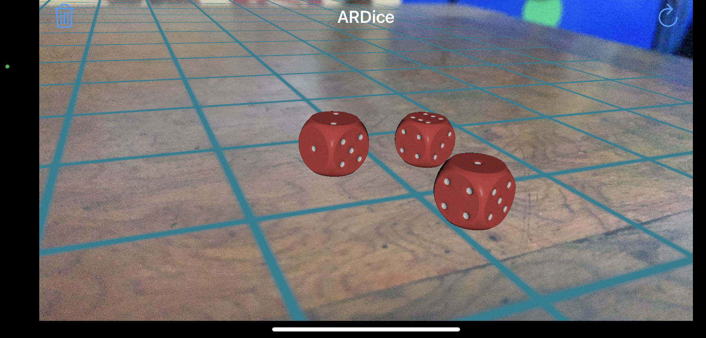

# AR-Dice
Simple and fun to use iOS app made to make Augmented reality (AR) be in our daily life or at least a part of it.In this version of the app the dice which we tend to lose very easily is replaced by an AR dice which always stays in our pocket forever.

# How to use 
- Point the iPhone's camera on a horizontal surface.(Through view finder)
- The app will automatically detect a horizontal plane and will place a horizontal grid on the surface.
- So, yeah you're good to go. That was it.
- Touch inside the grid and you'll get an AR Die with every tap.

# App icon

# Features

- You get two functional buttons on the top left and right.
- One is delete button which deletes all the dice on the AR grid.
- The other one is refresh button which spines all the dice.
- You can put as many dice as you want 
- You're the master of this app. Nothing more nothing less.

# App Demo

 

 
 
 

 

 

 

